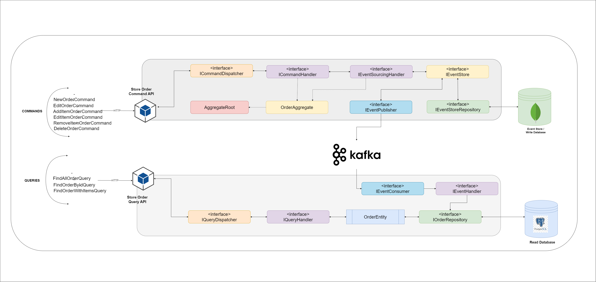

# sales-product-cqrs-event-sourcing-with-kafka
This repository is a lab to apply cqrs and event sourcing architect

### Architecture

### Todo List 

* Implement SaleProduct.Cmd.Infrastructure - In Progress
* Implement SaleProduct.Cmd.Domain
* Implement SaleProduct.Cmd.Api

* Implement SaleProduct.Common

* Implement SaleProduct.Query.Cmd.Infrastructure
* Implement SaleProduct.Query.Domain
* Implement SaleProduct.Query.Api

### Structure 

- CQRS 
	- Command
		- Api 
			- Commands 
			- Controllers
		- Domain
			- Aggregates
		- Infrastructure
			- Config 
			- Dispatchers
			- Handlers 
			- Producers
			- Repositories 
			- Stores
	- Query
		- api 
			- controllers
			- dtos 
			- queries
		- domain 
			- Entities 
			- Repositories
		- infraestructure
			- consumers 
			- converters
			- dataAccess 
			- dispatchers
			- handlers 
			- repositories
	- Commons library
		- dtos
		- events
	- SDK CQRS
		- commands 
			- BaseCommand
		- consumers
			- IEventConsumer
		- domain 
			- AggregateRoot 
			- IEventStoreRepository
		- events 
			- BaseEvent 
			- EventModel
		- exceptions 
			- AggregateNotFoundException
			ConcurrencyException
		- handlers 
			- IEventSourcingHandler
		- infrastructure 
			- ICommandDispatcher
			- IEventStore 
			- IQueryDispatcher
		- messages 
			- Message
		- producers 
			- IEventProducer
		- queries
			- BaseQuery